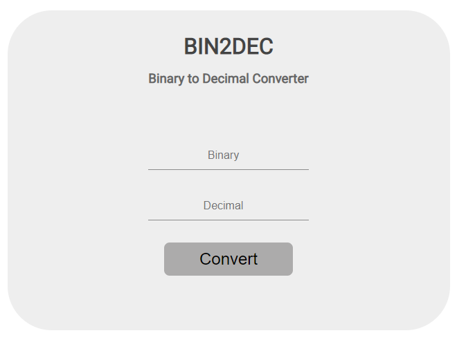

<h1 align="center">
  Bin2Dec
</h1>

## Tecnologias

Esse projeto foi desenvolvido com as seguintes tecnologias:

- HTML
- CSS
- JavaScript

## Projeto

O Bin2Dec é um projeto inspirado na App Idea [Bin2Dec](https://github.com/florinpop17/app-ideas/blob/master/Projects/1-Beginner/Bin2Dec-App.md) por [florinpop17](https://github.com/florinpop17). Basicamente é um conversor de números de base binária para decimal.

## Layout

Esse é o layout do projeto
 
 

## Acesso

O projeto pode ser acessado e testado [aqui](https://gabrielpdb.github.io/bin2dec/)

Made by [GabrielPDB](https://github.com/GabrielPDB)
